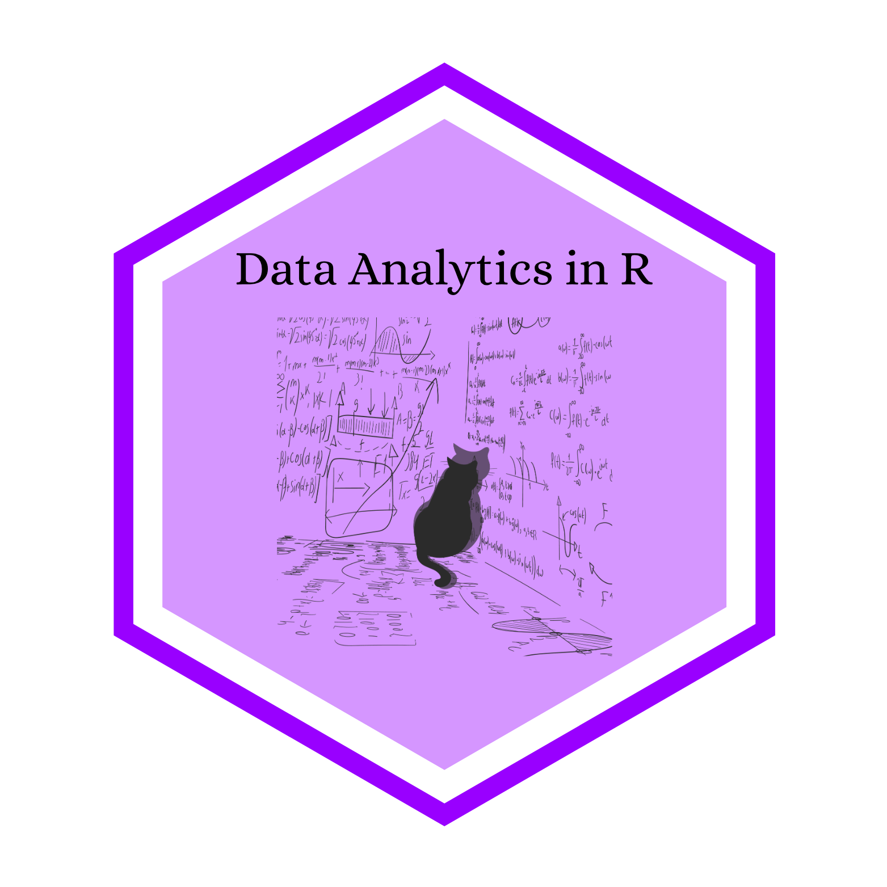

This free course is intended to sharpen your data analytic skills to prepare you to transition to jobs and careers requiring such skills. This course will involve classes covering data visualization, data wrangling, and data analytics. We also plan to add courses for more advanced topics in the future. For each topic, we provide a set intensive practice problem sets that will help you learn concepts covered in class. Some of the exercises will be based on topics covered during the lecture and some will require you to think a bit creatively and maybe do some searching online.

{fig-align="center" width="288"}